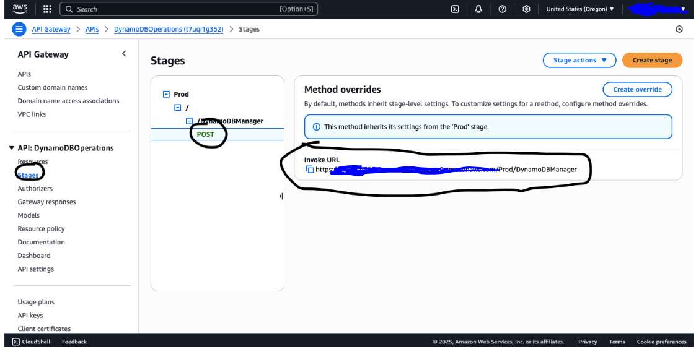
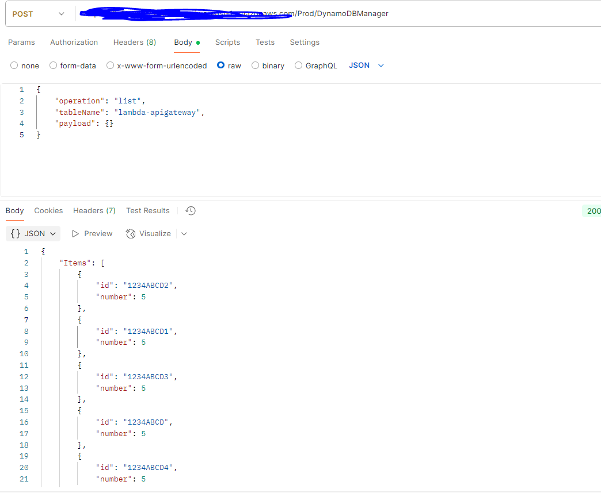
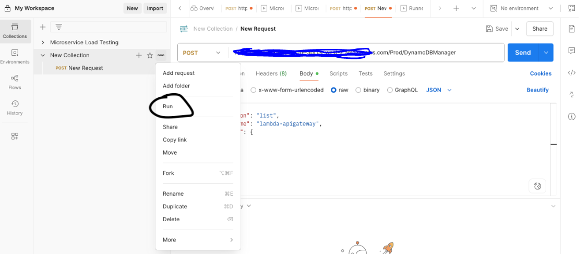
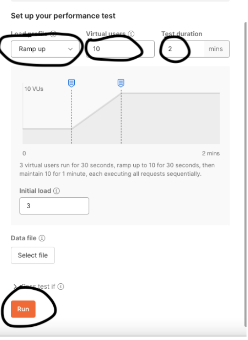
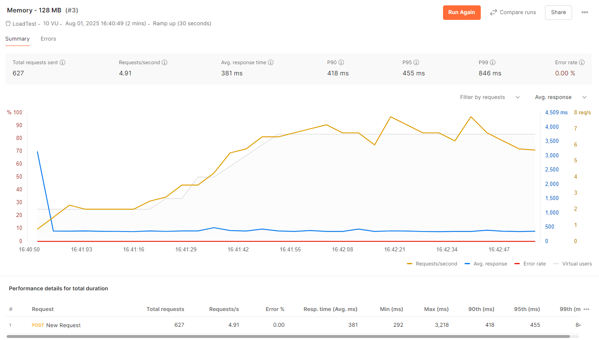
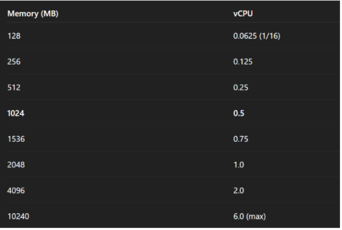
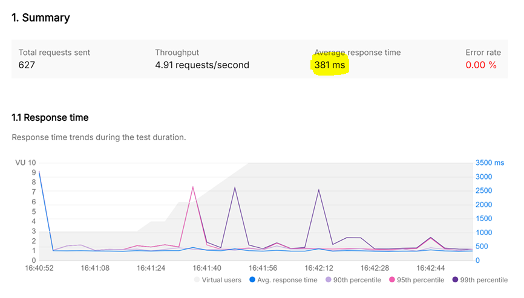
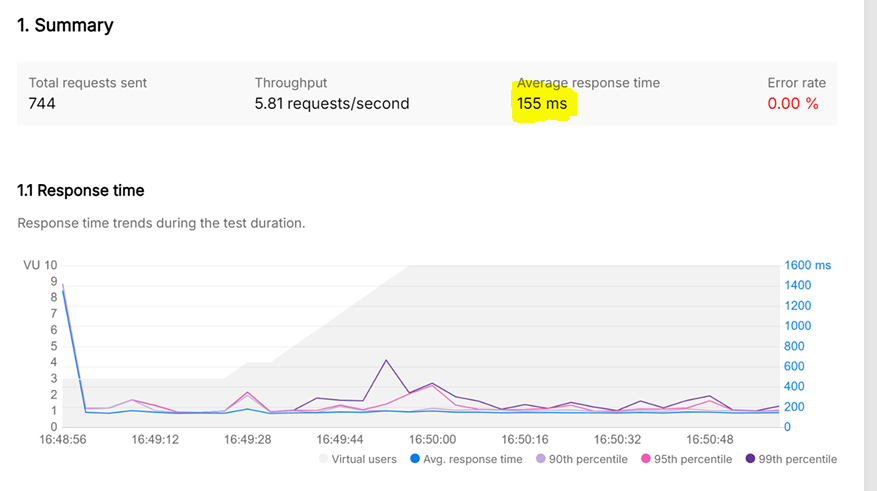
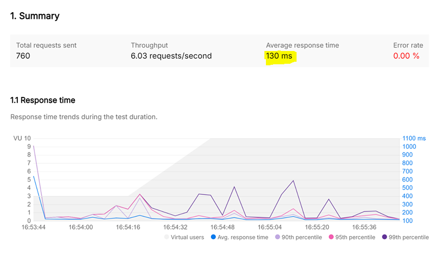
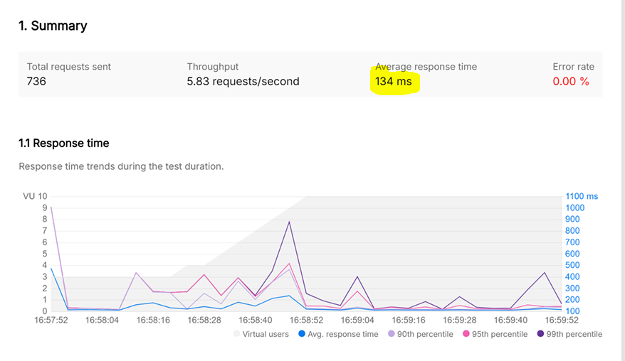

## Load testing our serverless application  
### Postman Setup  
1. Make sure you have the latest Postman app https://www.postman.com/downloads/  
2. Open the postman desktop app and click on "New" in the top left
3. Select "HTTP" from the options.  
4. Change the method to "POST"  
5. Click on the "Body" and the  select the "raw" option
6. copy and paste the below json into the body 
```json
{
    "operation": "list",
    "tableName": "lambda-apigateway",
    "payload": {
    }
}
```
7. Get the url from API Gateway stages we created previously  
  

8. past the url into the url section in the postman  
9. Click on "Save" in the top right.  
10. Click on "Send".  
You should see the response similar to the response in the below images depending on the number of item added. 
  

### Load Test  
1. Right click on the new request you just created.  
  
2. Click on "Performance", then select "Ramp up" under load profile  
3. select “10” in Virtual users, and Test duration as 2 mins. Click Run!

4. Atfer the load test is run you can see the result. (You can also export the result as pdf).  


#### Now that you have the results from the load test, lets change the lambda default memory (128 MB) to some increased memory and run the load test again and see the difference in the performance.  
As we increase Lambda memory, it gets more vCPU (mapping below)  
  
As the memory and cpu increases, you will notice the performance change in the lambda.   
I ran the tests using different memory configuration. Attached the summary of each test below  
#### 1. Memory: 128 MB  
  

#### 2. Memory: 512 MB  
  

#### 3. Memory: 1024 MB  
  

#### 4. Memory: 2048 MB  
  

🔍 Takeaways:  

⭐ Response time dropped sharply (381 ms ➡️ 155 ms) as I moved from 128 MB to 512 MB.  
⭐ Further increases in memory produced diminishing returns for performance—little improvement above 512 MB.  
⭐ However, cost crept up steadily as memory increased, with the largest jump between 1024 MB and 2048 MB.  

  

💡 Rule of thumb: Don’t just set the memory to the minimum or max! Find your function’s optimal point by testing and visualizing both cost and speed—for most workloads, “just enough” is best.


